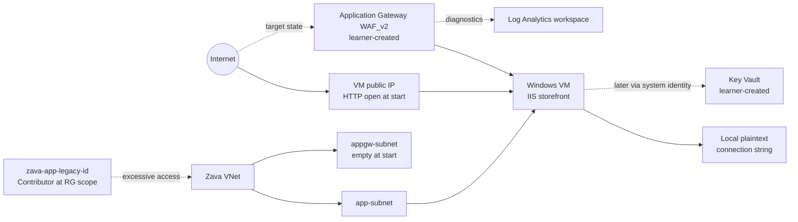

# Getting Started: Hardening Cloud-Native Apps with Secrets, Identity, and WAF

## Scenario

Zava Retail runs a working storefront on a single Windows Server virtual machine. The application works, but its security posture is intentionally weak: a sample connection string is stored locally in plaintext, the storefront is reachable directly through the VM public IP, and the legacy user-assigned managed identity `zava-app-legacy-id` has **Contributor** at resource-group scope. Your mission is to harden the existing application without rebuilding it.

This is a challenge-oriented lab. You are expected to make design choices, use Azure portal or command-line tooling as appropriate, and produce evidence that each control is working.

> [!Important]
> The connection string in this lab is a sample security artifact only. There is **no backing database**, no SQL deployment, and the storefront never opens a database connection.

## Sign in to Azure

1. Open <https://portal.azure.com> in an InPrivate or private browser window.
2. Sign in with the lab credentials:
   - Username: <inject key="AzureAdUserEmail"></inject>
   - Password: <inject key="AzureAdUserPassword"></inject>
3. Confirm you are working in the correct lab tenant and subscription:
   - Tenant ID: <inject key="TenantID"></inject>
   - Subscription ID: <inject key="SubscriptionID"></inject>
4. If you use Azure Cloud Shell, launch **Cloud Shell** from the Azure portal top navigation. A Bash or PowerShell shell is acceptable. If prompted for Cloud Shell storage, an ephemeral session is sufficient for this lab.
5. If you use the Azure CLI locally instead of Cloud Shell, sign in interactively and set the correct subscription. Use the subscription ID shown above.

```azurecli
az login
az account set --subscription "$SUBSCRIPTION_ID"
az account show --query "{name:name,id:id,tenantId:tenantId}" -o table
```

> [!Note]
> Cloud Shell automatically authenticates you to Azure portal sessions. Local Azure CLI sessions require `az login`. In either case, verify the active subscription before creating or changing resources. If you use the sample command above, first set `SUBSCRIPTION_ID` in your shell to the subscription ID shown in this page.

## Lab resource scope

Use the lab resource group associated with **zava-lab-<inject key="DeploymentID" enableCopy="false"></inject>**. The exact resource group name may include your CloudLabs deployment suffix; use the Azure portal resource group list or your lab environment page to confirm it before making changes. Only the resource group/deployment marker is suffixed; use the exact resource names shown in this guide unless a row explicitly says to choose a unique name.

When you create learner-owned resources, use the naming conventions in this guide so the validation checks can discover your work:

| Component | Expected name or pattern |
| --- | --- |
| Storefront VM | `zava-web-vm` |
| Application subnet | `app-subnet` |
| Application Gateway subnet | `appgw-subnet` |
| Legacy user-assigned identity | `zava-app-legacy-id` |
| Learner-created Key Vault | `kv-zava-<unique>` |
| Required secret | `ZavaAppConnectionString` |
| Learner-created Application Gateway | `agw-zava-waf` |
| Learner-created WAF policy | `wafpol-zava` |
| Required WAF custom rule | `Block-ZavaAttack-Header` |
| WAF test header | `X-Zava-Attack: true` |
| Storefront health endpoint | `/health` |
| Storefront source endpoint | `/config-status` |

## Initial state: what is already deployed

The deployment gives you a working but insecure baseline:

- A virtual network with two subnets:
  - `app-subnet` contains the storefront VM.
  - `appgw-subnet` is empty and reserved for the Application Gateway you will create.
- A Windows Server VM running IIS and the lightweight Zava Retail storefront.
- A VM public IP address.
- A network security group rule that permits direct inbound HTTP to the VM at lab start.
- A local plaintext sample connection string in the storefront configuration.
- A `/health` endpoint that reports whether the storefront is healthy.
- A `/config-status` endpoint that reports whether the active configuration source is `Local` or `KeyVault` without exposing the secret value.
- A user-assigned managed identity named `zava-app-legacy-id`.
- A resource-group-scope **Contributor** assignment for `zava-app-legacy-id`.
- A Log Analytics workspace for the Application Gateway diagnostics that you will configure later.

## Initial state: what is deliberately absent

The following resources and settings are **not** created for you. Their absence is intentional and should be visible before you begin:

- No Azure Key Vault.
- No Key Vault secret.
- No VM system-assigned managed identity.
- No role assignment for a VM system-assigned managed identity.
- No Application Gateway.
- No WAF policy.
- No Application Gateway diagnostic setting.
- No database of any kind.

Do not treat these absences as deployment failures. They are the security gaps you will close during the lab.

## Architecture



### Target architecture after hardening

By the end of the lab, the public entry point changes from the VM public IP to Application Gateway WAF_v2. The storefront retrieves `ZavaAppConnectionString` from an Azure RBAC-mode Key Vault through the VM system-assigned managed identity. Application Gateway diagnostics send both access and firewall logs to Log Analytics, and the legacy identity is reduced from broad Contributor access to metadata-only Key Vault visibility.

## What you will build

This lab has four exercises:

1. **Create the vault and govern the secret with managed identity**  
   Create an Azure RBAC-mode Key Vault, assign your own lab account **Key Vault Secrets Officer**, store `ZavaAppConnectionString`, enable the VM system-assigned identity, assign it **Key Vault Secrets User**, and switch the app from local plaintext to Key Vault retrieval.

2. **Deploy WAF_v2, enable diagnostics, then prove the block**  
   Deploy Application Gateway WAF_v2 in `appgw-subnet`, associate a WAF policy in **Prevention** mode, create custom rule `Block-ZavaAttack-Header`, enable gateway diagnostics before testing, and prove the block appears in Log Analytics.

3. **Remove excessive access and rotate the governed secret**  
   Remove the legacy identity’s resource-group Contributor assignment, assign it only **Key Vault Reader** at vault scope, and rotate `ZavaAppConnectionString` using your own Secrets Officer access.

4. **Validate and report the defense-in-depth controls**  
   Assemble evidence for secret governance, managed identity, WAF enforcement, telemetry, direct-exposure removal, least privilege, and rotation.

## Objectives

After completing this lab, you will be able to:

- Distinguish Azure management-plane permissions from Key Vault data-plane permissions.
- Use Azure RBAC-mode Key Vault roles to separate secret administration, runtime secret retrieval, and metadata-only visibility.
- Enable a system-assigned managed identity on an existing VM.
- Configure an existing app to retrieve a secret through managed identity rather than local plaintext.
- Deploy Application Gateway WAF_v2 as the internet-facing entry point for a VM-hosted workload.
- Use a WAF custom rule to block a deterministic request header.
- Configure Application Gateway diagnostic settings before generating test traffic.
- Query Log Analytics for WAF evidence that names the specific custom rule.
- Remove direct public HTTP exposure to a backend VM while preserving gateway-to-backend connectivity.
- Replace excessive identity permissions with a least-privilege role assignment.

## Important constraints

Use these constraints as guardrails throughout the challenge:

- The Key Vault must be created by you, not by the initial deployment.
- The Key Vault must use the Azure RBAC authorization model.
- Your own signed-in lab account must have **Key Vault Secrets Officer** at vault scope before you create or rotate the secret.
- The VM system-assigned identity must receive **Key Vault Secrets User** at vault scope only.
- The legacy identity `zava-app-legacy-id` must not receive a secret-read or secret-write role.
- **Key Vault Reader** is the intended final role for `zava-app-legacy-id`; it permits metadata visibility but not secret-value retrieval.
- Application Gateway diagnostics must be configured on the **Application Gateway resource**, not on the WAF policy.
- Enable `ApplicationGatewayFirewallLog` and `ApplicationGatewayAccessLog` before generating the blocked test request. Diagnostic logs are not retrospective.
- The WAF policy must be in **Prevention** mode when you prove enforcement.
- Direct VM public HTTP access must be removed or blocked after gateway routing is working.
- Do not create a database. The lab does not require or validate database connectivity.

## Evidence expectations

This lab is successful only when your evidence shows the full chain of controls working together:

- The exact secret `ZavaAppConnectionString` exists in your Key Vault.
- `/config-status` reports `KeyVault` and does not reveal the secret value.
- `/health` succeeds after the source switch and after rotation.
- The VM has a system-assigned managed identity.
- The VM identity has **Key Vault Secrets User** at vault scope and no broad write access.
- Application Gateway WAF_v2 fronts the storefront.
- Normal gateway traffic succeeds.
- Requests containing `X-Zava-Attack: true` are blocked.
- Log Analytics contains a WAF firewall event naming `Block-ZavaAttack-Header`.
- Direct public HTTP access to the VM is no longer available.
- `zava-app-legacy-id` no longer has resource-group Contributor and has only **Key Vault Reader** at vault scope.
- The secret has at least two enabled versions after rotation.

## Tips for working the challenge

- Prefer vault-scope role assignments for Key Vault data-plane roles in this lab.
- If you receive a Key Vault `Forbidden` response immediately after assigning yourself **Key Vault Secrets Officer**, wait several minutes and retry before changing permissions.
- Use the Application Gateway backend health view before troubleshooting WAF rules. A WAF block is only meaningful after ordinary traffic routes successfully.
- Use resource-specific Application Gateway tables such as `AGWFirewallLogs` and `AGWAccessLogs` when your diagnostic setting is configured for resource-specific logs. If you choose the legacy Azure Diagnostics destination mode, query `AzureDiagnostics` with category filters.
- Keep notes as you work. Exercise 4 asks you to map each control to its security benefit and evidence.

## Suggested time plan

| Section | Estimated time |
| --- | ---: |
| Exercise 1: Key Vault, secret, and VM managed identity | 75 minutes |
| Exercise 2: Application Gateway WAF_v2, diagnostics, and block evidence | 95 minutes |
| Exercise 3: Least privilege and secret rotation | 45 minutes |
| Exercise 4: Final validation and hardening report | 25 minutes |
| **Total** | **240 minutes** |

## After publishing

> [!Note] These steps run **after** you push the template to CloudLabs — they verify CloudLabs can actually serve this lab guide to candidates.

- **Verify docs-proxy access:** open Templates → your template → **Lab Guide Settings** in <https://admin.cloudlabs.ai> and confirm CloudLabs can reach this repo via the docs proxy. If the repo is private, configure GitHub access at the template level.
- **Verify inline questions and inline validations:** sign in to <https://admin.cloudlabs.ai>, open your template, and walk through one full lab run to confirm every `<question>` and `<validation step="..."/>` renders correctly. Fix any that don't resolve.
